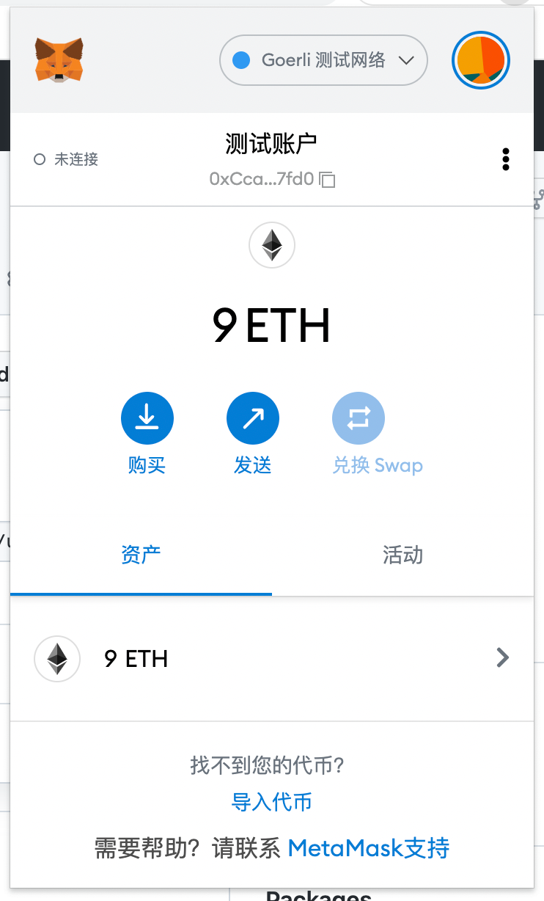

## w1作业
### 1. 安装Metamask

### 2. 执行一次转账
> https://goerli.etherscan.io/tx/0x68f473849a599969aadd8df24508b5083230ed948b1004c325e0b15ad4abd8fc

### 3. 使用 Remix 创建任意一个合约
> https://goerli.etherscan.io/tx/0xf41b3a9bb0d40705195176e8b5926d12e7226834e1064291b320afde9f70a9d1

### 4. VSCode IDE 开发环境配置
- [vscode](assets/vscode+solidity.png)

### 5. 使用 Truffle 部署 Counter 合约 到 test 网络（goerli）（提交交易 hash）

### 6. 编写一个测试用例